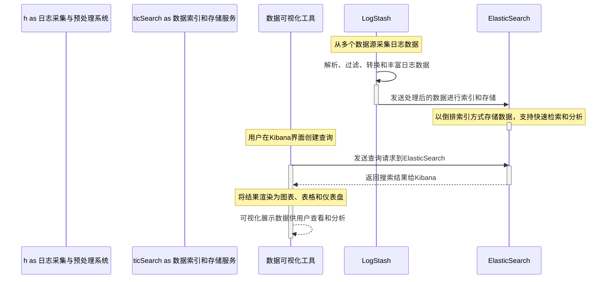
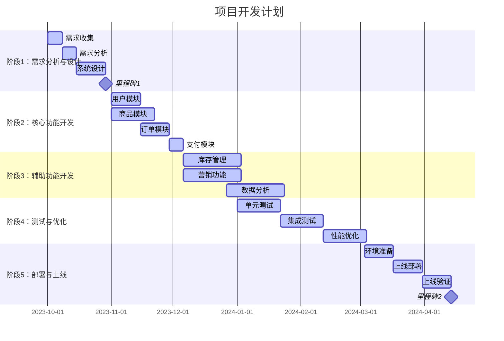
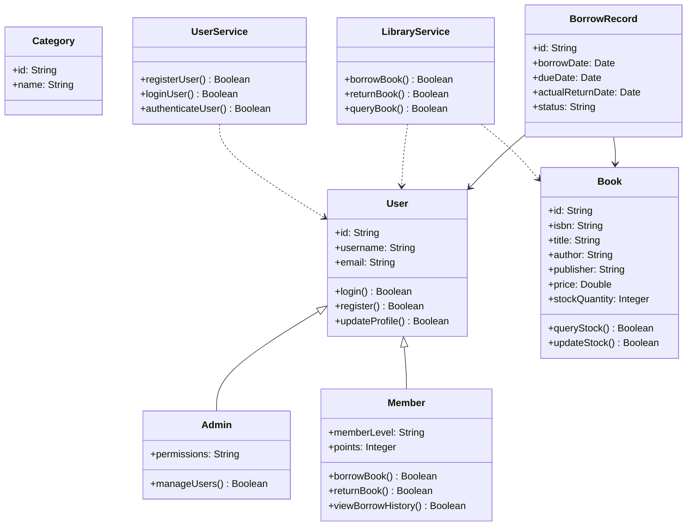
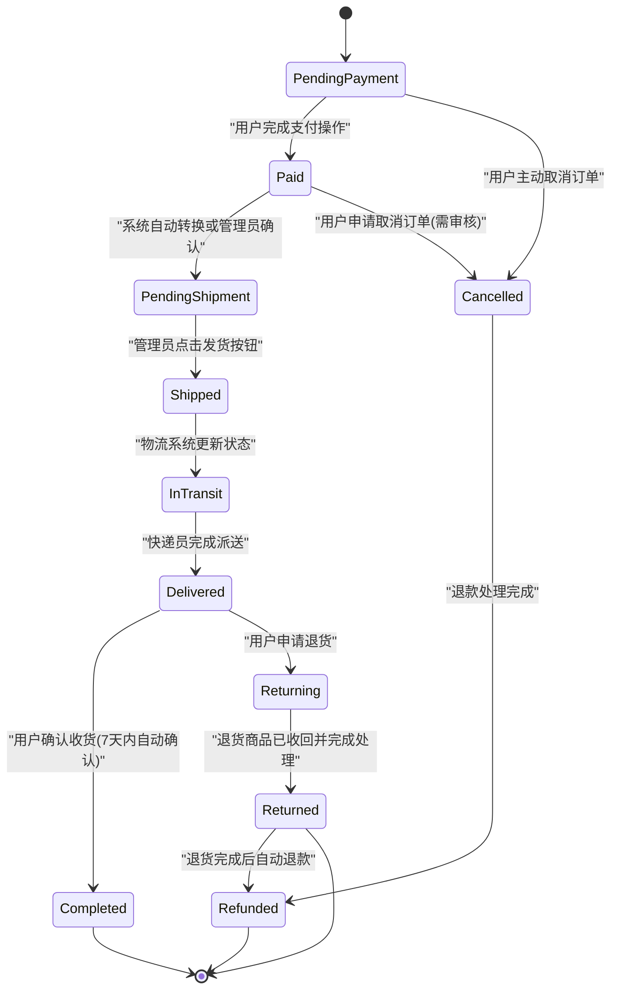
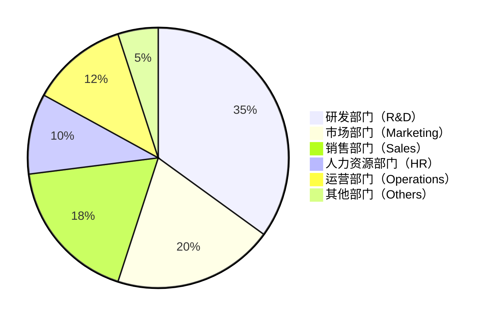
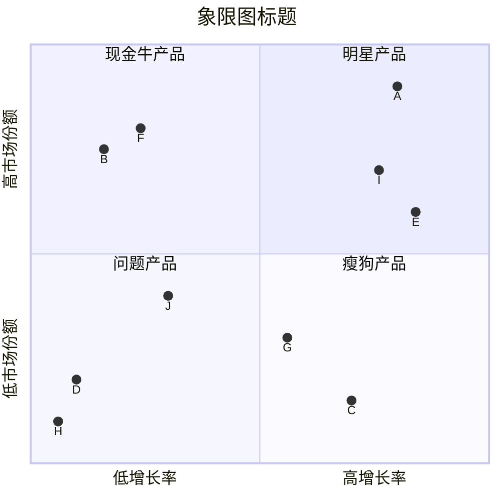
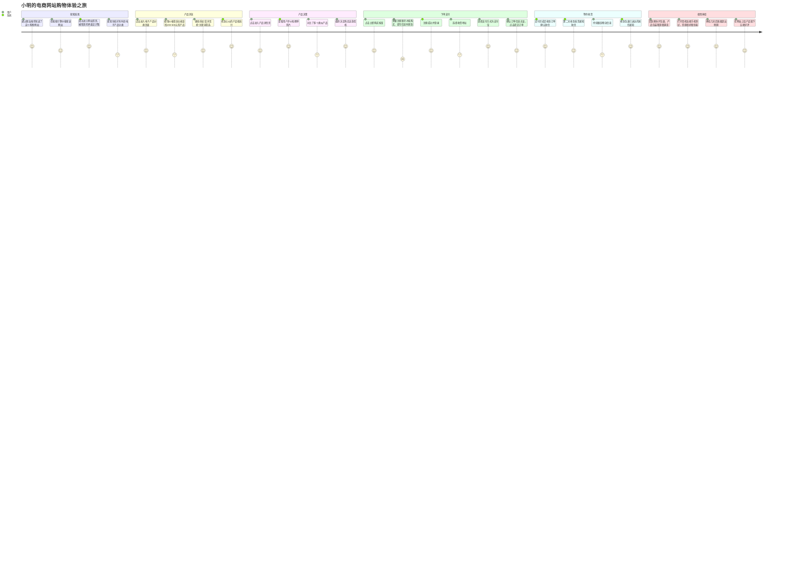

```mermaid
flowchart TD
Start([用户访问平台]) --> Homepage[首页]

    Homepage --> Choose{选择操作}
    Choose -->|注册| Register[注册新账号]
    Choose -->|登录| Login[使用已有账号登录]
    
    Register --> FillInfo[填写用户名、邮箱和密码]
    FillInfo --> Validate[系统验证信息格式]
    Validate --> SendEmail[发送验证邮件]
    SendEmail --> VerifyEmail{验证通过?}
    VerifyEmail -->|是| AccountCreated[账号创建成功]
    VerifyEmail -->|否| FillInfo
    AccountCreated --> Login
    
    Login --> PersonalCenter[个人学习中心]
    
    PersonalCenter --> Browse{浏览课程}
    Browse -->|浏览列表| CourseList[课程列表]
    Browse -->|搜索课程| Search[搜索课程]
    
    CourseList --> CourseDetails[查看课程详情<br/>课程简介、教学大纲、讲师介绍]
    Search --> CourseDetails
    
    CourseDetails --> Decision{是否满意?}
    Decision -->|不满意| Browse
    Decision -->|满意| CheckPayment{课程需要付费?}
    
    CheckPayment -->|是| Payment[跳转支付页面]
    CheckPayment -->|否| Enroll[加入学习计划]
    Payment --> Pay[完成支付]
    Pay --> Enroll
    
    Enroll --> StartLearning[开始学习]
    
    StartLearning --> CompleteChapter[完成一个章节]
    CompleteChapter --> RecordProgress[系统记录学习进度]
    
    RecordProgress --> HasQuestion{遇到问题?}
    HasQuestion -->|是| DiscussionBoard[讨论区<br/>提问或查看回答]
    HasQuestion -->|否| CheckAllComplete{完成所有章节?}
    DiscussionBoard --> CheckAllComplete
    
    CheckAllComplete -->|否| StartLearning
    CheckAllComplete -->|是| CourseTest[课程测试]
    
    CourseTest --> TestResult{测试结果}
    TestResult -->|通过| Certificate[获得课程证书]
    TestResult -->|未通过| Retry{选择操作}
    
    Certificate --> UpdateProfile[更新个人学习档案]
    UpdateProfile --> End([结束])
    
    Retry -->|重新学习| StartLearning
    Retry -->|重新测试| CourseTest
    
    StartLearning --> Pause{暂停学习?}
    Pause -->|是| SaveProgress[保存当前进度]
    SaveProgress --> End
```

# Mermaid AI Studio 功能演示

本文档展示了 Mermaid AI Studio 对各种图表类型的生成能力。

## 1. 流程图（Flowchart）

### 测试案例

**给定的测试文本：**

用户访问平台后，首先进入首页，可以选择注册新账号或使用已有账号登录。如果选择注册，需要填写用户名、邮箱和密码，系统会验证信息格式并发送验证邮件。验证通过后，账号创建成功，可以登录。

登录成功后，用户进入个人学习中心，可以浏览课程列表或搜索感兴趣的课程。选择课程后，查看课程详情，包括课程简介、教学大纲和讲师介绍。如果满意，可以加入学习计划；如果课程需要付费，会跳转到支付页面完成支付后再加入。

加入课程后，用户开始学习。每完成一个章节，系统会记录学习进度。如果遇到问题，可以在讨论区提问或查看其他学员的回答。完成所有章节后，可以进行课程测试。测试通过后，获得课程证书并更新个人学习档案。

如果测试未通过，可以选择重新学习相关章节或重新参加测试。整个学习过程中，用户可以随时暂停学习，系统会保存当前进度，下次登录时可以继续学习。

### 生成的 Mermaid 代码

---

## 2. 时序图（Sequence Diagram）

### 测试案例

**给定的测试文本：**

数据采集：LogStash从多个数据源（文件、数据库、消息队列等）采集日志数据。

数据预处理：LogStash对采集的日志进行解析、过滤、转换和丰富（如提取字段、添加标签）。

数据索引：处理后的数据被发送到ElasticSearch集群进行索引和存储。

数据存储：ElasticSearch将数据以倒排索引方式存储，支持快速检索和分析。

可视化查询：Kibana通过REST API连接到ElasticSearch，用户可在Kibana界面创建查询。

数据检索：Kibana的查询请求发送到ElasticSearch，执行搜索和聚合。

结果返回：ElasticSearch返回搜索结果给Kibana。

可视化展示：Kibana将结果渲染为图表、表格和仪表盘，供用户查看和分析。

### 生成的 Mermaid 代码

---

## 3. 甘特图（Gantt Chart）

### 测试案例

**给定的测试文本：**

阶段1：需求分析与设计（3周）
- 需求收集：与业务团队访谈，收集功能需求和非功能需求
- 需求分析：整理需求文档，确定优先级，预计1周
- 系统设计：架构设计、数据库设计、接口设计，预计2周
- 里程碑：需求评审通过，设计文档完成

阶段2：核心功能开发（8周）
- 用户模块：用户注册、登录、个人中心，预计2周
- 商品模块：商品管理、分类管理、搜索功能，预计3周
- 订单模块：购物车、下单流程、订单管理，预计2周
- 支付模块：支付集成、订单支付、退款处理，预计1周

阶段3：辅助功能开发（4周）
- 库存管理：库存查询、库存预警、出入库记录
- 营销功能：优惠券系统、促销活动管理
- 数据分析：销售报表、用户行为分析

阶段4：测试与优化（3周）
- 单元测试：各模块单元测试编写和执行
- 集成测试：系统集成测试，接口联调
- 性能优化：数据库优化、接口性能调优
- 里程碑：测试通过，性能达标

阶段5：部署与上线（2周）
- 环境准备：生产环境搭建、数据库初始化
- 上线部署：代码部署、数据迁移
- 上线验证：功能验证、监控检查
- 里程碑：正式上线

**关键约束：**
- 用户模块和商品模块可以并行开发
- 订单模块依赖用户模块和商品模块完成
- 支付模块依赖订单模块
- 测试阶段需要在所有开发完成后进行
- 总工期约20周

### 生成的 Mermaid 代码

---

## 4. 类图（Class Diagram）

### 测试案例

**给定的测试文本：**

用户相关类：
- User（用户）类：包含用户ID、用户名、密码、邮箱等属性，有登录、注册、修改个人信息等方法
- Admin（管理员）类：继承自User类，增加权限管理、删除用户等方法
- Member（会员）类：继承自User类，包含会员等级、积分等属性，有借书、还书、查看借阅历史等方法

图书相关类：
- Book（图书）类：包含图书ID、ISBN、书名、作者、出版社、价格、库存数量等属性，有查询、更新库存等方法
- Category（分类）类：包含分类ID、分类名称等属性，与Book是一对多关系

借阅相关类：
- BorrowRecord（借阅记录）类：包含记录ID、借阅日期、应还日期、实际归还日期、状态等属性，关联User和Book

系统功能类：
- LibraryService（图书服务）类：提供借书、还书、查询图书等方法，依赖Book和BorrowRecord类
- UserService（用户服务）类：提供用户注册、登录、认证等方法，依赖User类

类之间的关系包括：Admin和Member继承自User，Book与Category是关联关系（一本书属于一个分类），BorrowRecord关联User和Book，LibraryService和UserService分别依赖相关的实体类

### 生成的 Mermaid 代码

---

## 5. 状态图（State Diagram）

### 测试案例

**给定的测试文本：**

订单从创建开始，包含以下状态：
待支付（Pending Payment）：订单刚创建时的初始状态
已支付（Paid）：用户完成支付后进入此状态
待发货（Pending Shipment）：支付完成后，订单进入待发货状态
已发货（Shipped）：商家发货后，订单进入已发货状态
运输中（In Transit）：订单在物流运输过程中
已送达（Delivered）：订单已送达用户
已完成（Completed）：用户确认收货后，订单完成
已取消（Cancelled）：用户可以取消待支付和已支付的订单
已退款（Refunded）：订单被取消或用户申请退款后进入此状态
退货中（Returning）：用户申请退货后进入此状态
已退货（Returned）：退货完成后的最终状态
状态转换规则：
待支付 → 已支付：用户完成支付操作
已支付 → 待发货：系统自动转换或管理员确认
待发货 → 已发货：管理员点击发货按钮
已发货 → 运输中：物流系统更新状态
运输中 → 已送达：快递员完成派送
已送达 → 已完成：用户确认收货（7天内自动确认）
待支付 → 已取消：用户主动取消订单
已支付 → 已取消：用户申请取消订单（需审核）
已取消 → 已退款：退款处理完成
已送达 → 退货中：用户申请退货
退货中 → 已退货：退货商品已收回并完成处理
已退货 → 已退款：退货完成后自动退款

### 生成的 Mermaid 代码

---

## 6. 饼图（Pie Chart）

### 测试案例

**给定的测试文本：**

公司共有以下6个部门的预算分配情况：
- 研发部门（R&D）：350万元，占比35%
- 市场部门（Marketing）：200万元，占比20%
- 销售部门（Sales）：180万元，占比18%
- 人力资源部门（HR）：100万元，占比10%
- 运营部门（Operations）：120万元，占比12%
- 其他部门（Others）：50万元，占比5%

预算总额为1000万元。

### 生成的 Mermaid 代码

---

## 7. 象限图（Quadrant Chart）

### 测试案例

**给定的测试文本：**

象限划分规则：
X轴（横轴）：市场增长率，范围从0%到50%
左侧（0%-25%）：低增长率
右侧（25%-50%）：高增长率
Y轴（纵轴）：相对市场份额，范围从0到2.0
下方（0-1.0）：低市场份额
上方（1.0-2.0）：高市场份额
四个象限定义：
明星产品（右上象限）：高增长率 + 高市场份额 - 处于快速增长期，需要持续投资
现金牛产品（左上象限）：低增长率 + 高市场份额 - 成熟稳定，产生大量现金流
问题产品（右下象限）：高增长率 + 低市场份额 - 有潜力但需评估是否值得投资
瘦狗产品（左下象限）：低增长率 + 低市场份额 - 表现不佳，考虑退出
产品数据点：
产品A：市场增长率40%，相对市场份额1.8 - 明星产品
产品B：市场增长率8%，相对市场份额1.5 - 现金牛产品
产品C：市场增长率35%，相对市场份额0.3 - 问题产品
产品D：市场增长率5%，相对市场份额0.4 - 瘦狗产品
产品E：市场增长率42%，相对市场份额1.2 - 明星产品
产品F：市场增长率12%，相对市场份额1.6 - 现金牛产品
产品G：市场增长率28%，相对市场份额0.6 - 问题产品
产品H：市场增长率3%，相对市场份额0.2 - 瘦狗产品
产品I：市场增长率38%，相对市场份额1.4 - 明星产品
产品J：市场增长率15%，相对市场份额0.8 - 介于问题产品和现金牛之间

### 生成的 Mermaid 代码

---

## 8. 用户旅程图（User Journey）

### 测试案例

**给定的测试文本：**

用户角色：小明，25岁，第一次在该电商网站购物，想要购买一副蓝牙耳机。

整个购物旅程分为以下几个阶段：

阶段一：探索发现
- 通过朋友推荐知道了这个购物网站，内心好奇并期待能找到合适的产品
- 在搜索引擎中搜索该网站，期望能找到正品好物
- 成功进入网站首页，被精美的界面设计吸引
- 发现导航栏有时尚电子产品分类，想先看看有什么

阶段二：产品浏览
- 点击进入电子产品分类页面，看到琳琅满目的商品很兴奋
- 使用价格筛选功能查找200-500元的产品，发现选择范围太大有些困扰
- 继续添加"蓝牙耳机"关键词筛选，找到心仪的产品很高兴
- 浏览搜索结果列表，被一个评价很高的产品吸引

阶段三：产品决策
- 点击进入产品详情页，看到详细的功能介绍很感兴趣
- 查看用户评价和晒单照片，发现用户反馈都很正面
- 对比了多个类似产品，感觉价格适中
- 最终决定购买这款耳机，感到很满意

阶段四：下单支付
- 点击立即购买按钮，对即将拥有新产品很兴奋
- 需要注册账号才能购买，填写信息时感到有点麻烦
- 注册成功并登录，准备继续购买流程
- 选择收货地址，发现可以保存常用地址很方便
- 选择支付方式为支付宝，感觉很便捷
- 确认订单信息无误，点击提交订单

阶段五：等待收货
- 支付完成后收到订单确认短信，很安心
- 第二天收到发货通知短信，很期待
- 持续跟踪物流信息，看到包裹在路上很兴奋
- 收到包裹已送达的短信通知，迫不及待想回家取

阶段六：使用体验
- 回到家拆开包裹，产品包装精美很满意
- 打开耳机连接手机测试，音质很好很惊喜
- 体验几天后效果超出预期，非常满意
- 在网站上给产品留下五星好评

### 生成的 Mermaid 代码

---

## 说明

本文档中的 Mermaid 代码示例展示了系统对各种图表类型的生成能力。部分图表类型（标注为"待生成"）将在后续版本中完善。

所有图表均支持：
- ✅ 自动语法修复
- ✅ 实时预览
- ✅ PNG 图片导出
- ✅ 源码编辑功能
